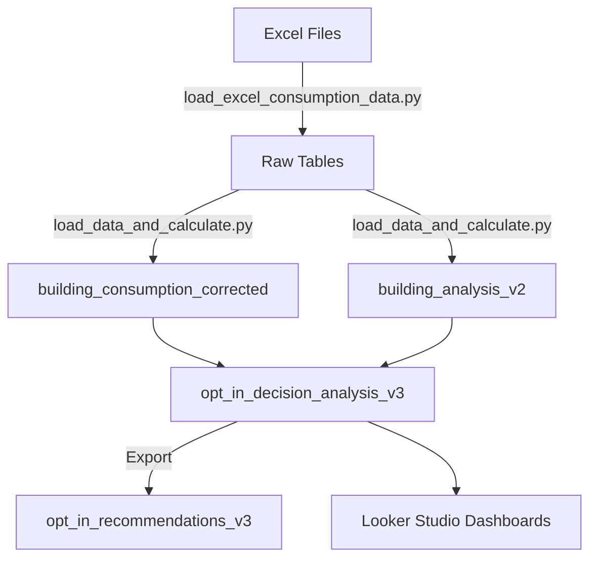

# BigQuery Schema Documentation
**Project:** energize-denver-eaas  
**Dataset:** energize_denver  
**Last Updated:** July 7, 2025

## 📊 Table Overview

### Core Tables

#### 1. `building_consumption_corrected`
**Description:** Latest energy consumption data with corrected calculations  
**Update Frequency:** Monthly  
**Row Count:** ~3,000  

| Column | Type | Description |
|--------|------|-------------|
| building_id | STRING | Unique building identifier |
| property_name | STRING | Building name |
| property_type | STRING | Building use type category |
| gross_floor_area | FLOAT64 | Total building square footage |
| year_built | INTEGER | Construction year |
| address | STRING | Street address |
| city | STRING | City (Denver) |
| state | STRING | State (CO) |
| zip_code | STRING | 5-digit postal code |
| latitude | FLOAT64 | GPS latitude |
| longitude | FLOAT64 | GPS longitude |
| electric_use_kbtu | FLOAT64 | Annual electricity consumption |
| natural_gas_use_kbtu | FLOAT64 | Annual gas consumption |
| total_ghg_emissions_mtco2e | FLOAT64 | Total GHG emissions |
| site_eui | FLOAT64 | Site Energy Use Intensity |
| weather_normalized_site_eui | FLOAT64 | Weather-adjusted EUI |
| year | INTEGER | Reporting year |
| status | STRING | Compliance status or exemption |
| last_updated | TIMESTAMP | Record update timestamp |

#### 2. `building_analysis_v2`
**Description:** EUI targets and compliance thresholds  
**Update Frequency:** When policy updates  
**Row Count:** ~3,000  

| Column | Type | Description |
|--------|------|-------------|
| building_id | STRING | Unique building identifier |
| property_type | STRING | Building use type category |
| baseline_eui | FLOAT64 | Historical baseline EUI |
| interim_target_default | FLOAT64 | 2027 target (default path) |
| final_target_default | FLOAT64 | 2030 target (default path) |
| interim_target_optin | FLOAT64 | 2028 target (opt-in path) |
| final_target_optin | FLOAT64 | 2032 target (opt-in path) |
| is_mai | BOOLEAN | Manufacturing/Agricultural/Industrial flag |
| mai_floor_applied | BOOLEAN | Whether 52.9 floor was applied |
| forty_two_cap_applied | BOOLEAN | Whether 42% cap was applied |

### Analytical Views

#### 3. `opt_in_decision_analysis_v3`
**Description:** Comprehensive opt-in decision analysis with financial modeling  
**Type:** VIEW  
**Dependencies:** building_consumption_corrected, building_analysis_v2  

| Column | Type | Description |
|--------|------|-------------|
| building_id | STRING | Unique building identifier |
| property_name | STRING | Building name |
| property_type | STRING | Building use type |
| gross_floor_area | FLOAT64 | Building size (sqft) |
| most_recent_site_eui | FLOAT64 | Latest reported EUI |
| baseline_eui | FLOAT64 | Historical baseline |
| reduction_required_pct | FLOAT64 | % reduction needed |
| meets_2025_target | BOOLEAN | Meets first threshold |
| meets_2027_target | BOOLEAN | Meets interim (default) |
| meets_2030_target | BOOLEAN | Meets final (default) |
| meets_2028_target | BOOLEAN | Meets interim (opt-in) |
| meets_2032_target | BOOLEAN | Meets final (opt-in) |
| penalty_2025_default | FLOAT64 | 2025 penalty if default |
| penalty_2027_default | FLOAT64 | 2027 penalty if default |
| penalty_2030_default | FLOAT64 | 2030 penalty if default |
| total_penalty_default | FLOAT64 | Sum of default penalties |
| penalty_2028_optin | FLOAT64 | 2028 penalty if opt-in |
| penalty_2032_optin | FLOAT64 | 2032 penalty if opt-in |
| total_penalty_optin | FLOAT64 | Sum of opt-in penalties |
| npv_default | FLOAT64 | Net present value default |
| npv_optin | FLOAT64 | Net present value opt-in |
| npv_savings | FLOAT64 | NPV difference (savings) |
| technical_difficulty_score | FLOAT64 | 0-100 difficulty rating |
| cash_flow_impact_score | FLOAT64 | Early penalty impact |
| opt_in_recommendation | STRING | 'Opt-In' or 'Default' |
| decision_rationale | STRING | Explanation of decision |
| decision_confidence | STRING | High/Medium/Low |
| data_year | INTEGER | Year of consumption data |
| is_exempt | BOOLEAN | Currently exempt status |

#### 4. `opt_in_recommendations_v3`
**Description:** Simplified recommendations table for reporting  
**Type:** TABLE  
**Update Frequency:** After each analysis run  

| Column | Type | Description |
|--------|------|-------------|
| building_id | STRING | Unique identifier |
| property_name | STRING | Building name |
| recommendation | STRING | Opt-In or Default |
| rationale | STRING | Decision explanation |
| confidence | STRING | Confidence level |
| total_penalty_avoided | FLOAT64 | Savings from recommendation |
| created_at | TIMESTAMP | Analysis timestamp |

#### 5. `penalty_calculations`
**Description:** Detailed year-by-year penalty projections  
**Type:** VIEW  

| Column | Type | Description |
|--------|------|-------------|
| building_id | STRING | Unique identifier |
| scenario | STRING | 'default' or 'optin' |
| year | INTEGER | Penalty year |
| target_eui | FLOAT64 | Target for that year |
| current_eui | FLOAT64 | Building's current EUI |
| eui_gap | FLOAT64 | Amount over target |
| penalty_rate | FLOAT64 | $/kBtu rate |
| annual_penalty | FLOAT64 | Year's penalty amount |
| discounted_penalty | FLOAT64 | NPV of penalty |

### Supporting Tables

#### 6. `epb_status`
**Description:** Equity Priority Building designations  
**Row Count:** ~300  

| Column | Type | Description |
|--------|------|-------------|
| building_id | STRING | Unique identifier |
| epb_designation | BOOLEAN | Is EPB |
| engagement_stage | STRING | Outreach status |
| last_contact | DATE | Last engagement date |

#### 7. `building_zipcode_lookup`
**Description:** Geographic and demographic data by zip  

| Column | Type | Description |
|--------|------|-------------|
| zip_code | STRING | 5-digit postal code |
| neighborhood | STRING | Denver neighborhood |
| council_district | INTEGER | City council district |
| median_income | FLOAT64 | Area median income |
| environmental_justice | BOOLEAN | EJ community flag |

## 🔄 Data Flow



## 📐 Key Business Rules in Schema

### 42% Cap Implementation
```sql
-- Applied in building_analysis_v2
final_target_capped = GREATEST(
    original_final_target,
    baseline_eui * 0.58  -- 42% max reduction
)
```

### MAI Floor Application
```sql
-- Manufacturing/Agricultural/Industrial minimum
IF is_mai THEN
    final_target = GREATEST(final_target, 52.9)
```

### NPV Calculation
```sql
-- 7% discount rate over analysis period
npv = SUM(penalty / POWER(1.07, year - 2025))
```

### Exemption Handling
```sql
-- Only use non-exempt years for analysis
WHERE status != 'Exempt' OR status IS NULL
```

## 🔍 Common Query Patterns

### Get High-Risk Buildings
```sql
SELECT *
FROM `energize_denver.opt_in_decision_analysis_v3`
WHERE total_penalty_default > 500000
ORDER BY total_penalty_default DESC
```

### Property Type Summary
```sql
SELECT 
    property_type,
    COUNT(*) as buildings,
    AVG(reduction_required_pct) as avg_reduction,
    SUM(total_penalty_default) as total_exposure
FROM `energize_denver.opt_in_decision_analysis_v3`
GROUP BY property_type
```

### Opt-In Impact Analysis
```sql
SELECT 
    opt_in_recommendation,
    COUNT(*) as count,
    SUM(npv_savings) as total_savings
FROM `energize_denver.opt_in_decision_analysis_v3`
GROUP BY opt_in_recommendation
```

## 🚨 Data Quality Checks

### Required Fields
- building_id: Must be unique, non-null
- site_eui: Must be positive number
- gross_floor_area: Must be > 25,000 for compliance

### Validation Rules
- EUI values: 0 < EUI < 1000 (outlier detection)
- Penalties: Must be non-negative
- Dates: Year must be 2020-2024 for historical data

## 📝 Notes

1. **Versioning**: Views ending in _v3 incorporate the 42% cap fix
2. **Update Cadence**: Consumption data updated monthly from city
3. **Privacy**: No PII stored; building contacts in separate system
4. **Performance**: Queries typically < 1 second for full dataset
5. **Backup**: Daily automated backups to Cloud Storage